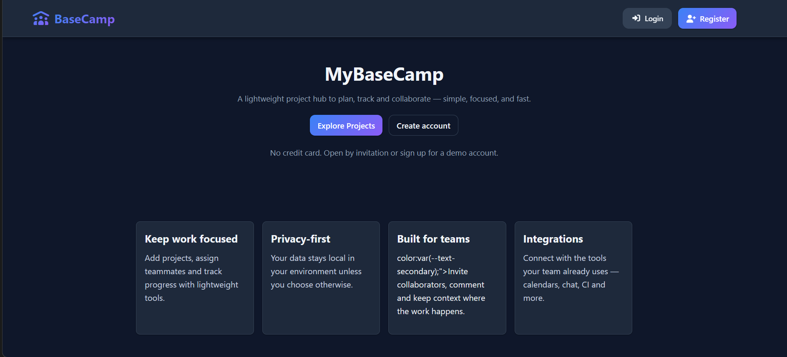
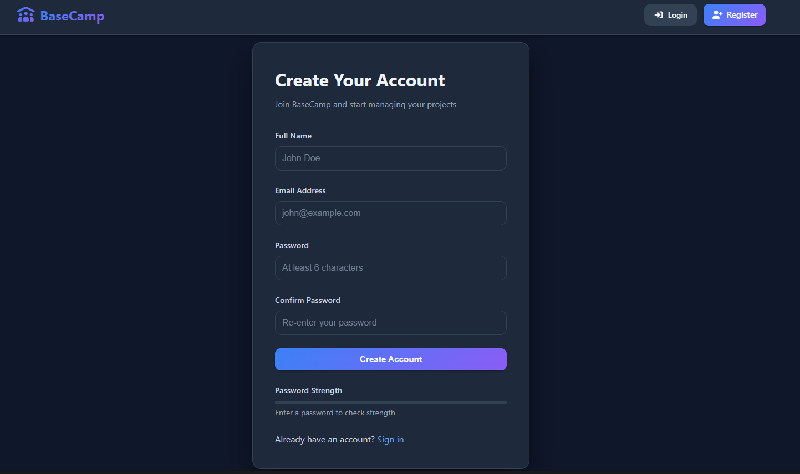
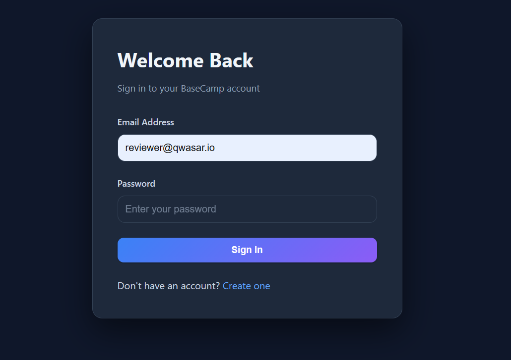
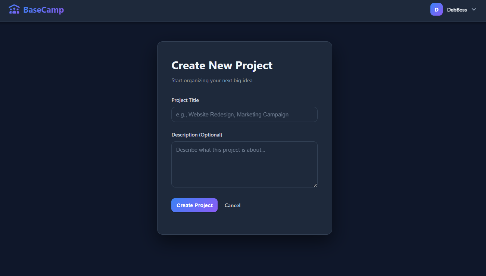
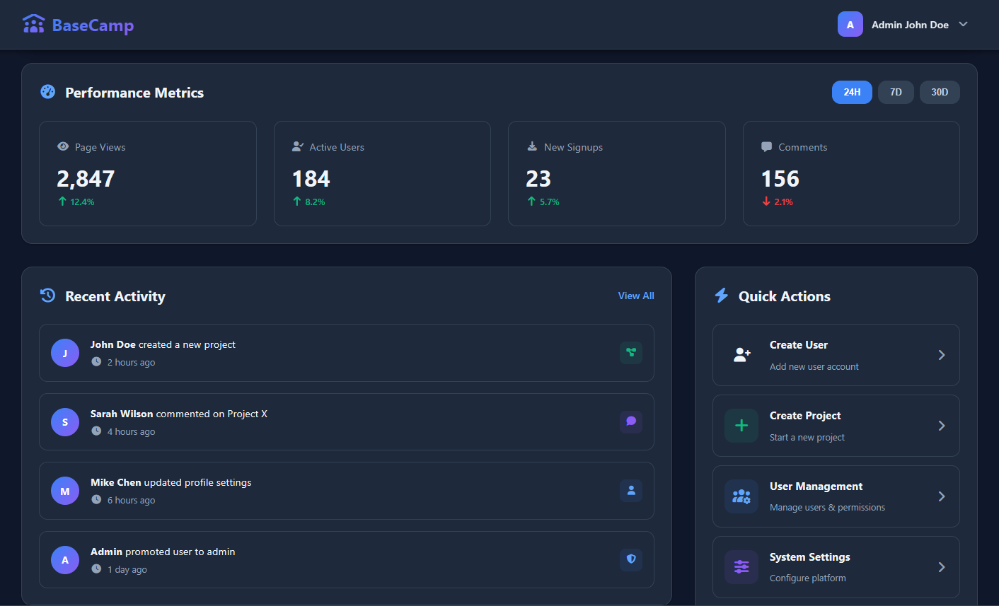

# Welcome to My Basecamp 1
***

## Task

**What is the problem?**

Modern software development teams need an efficient way to collaborate on projects, track progress, and communicate effectively. Teams often struggle with:
- Managing multiple projects simultaneously across different team members
- Keeping track of project assignments and responsibilities
- Maintaining clear communication through project-specific discussions
- Providing role-based access control for sensitive operations
- Managing user profiles and notification preferences

**Where is the challenge?**

The challenge lies in creating a lightweight yet feature-rich project management system that:
- Supports multiple users collaborating on the same project
- Implements secure authentication and authorization mechanisms
- Provides a clean, intuitive interface for project and comment management
- Handles complex relationships between users, projects, and assignments
- Offers administrative capabilities for user management without compromising security
- Ensures data persistence and integrity across multiple entities

## Description

**How have I solved the problem?**

MyBaseCamp1 is a full-stack web application built with Ruby and Sinatra that provides comprehensive project management capabilities. The solution includes:




### Architecture & Technology Stack

- **Backend Framework**: Sinatra (lightweight Ruby web framework)
- **ORM**: ActiveRecord for database abstraction and relationships
- **Database**: SQLite3 for data persistence
- **Authentication**: BCrypt for secure password hashing
- **Web Server**: Puma for concurrent request handling
- **Views**: ERB templates with responsive CSS styling

### Core Features Implemented

1. **User Authentication System**
   - Secure registration with password validation (minimum 6 characters)
   - Login/logout functionality with session management
   - Password encryption using BCrypt
   - Email uniqueness validation

2. **Project Management**
   - Create, read, update, and delete projects
   - Project ownership and access control
   - Project assignments (multiple users per project)
   - Project status tracking (active/inactive)
   - Tagging system for project categorization
   - Cover image support for projects
   - Pagination support for project listings

3. **Collaboration Features**
   - Comment system on projects with file attachments
   - Read/unread status tracking for comments
   - Bulk mark-as-read functionality
   - Real-time discussion threads
   - Comment editing and deletion capabilities

4. **User Profile Management**
   - Customizable user profiles with bio
   - Notification preferences (email notifications, weekly digest)
   - Timezone and language settings
   - Public/private profile visibility
   - Security settings page

5. **Administrative Dashboard**
   - User management (create, edit, promote/demote, view)
   - System statistics and growth metrics
   - Recent activity monitoring
   - Role-based access control (admin vs regular users)
   - Self-demotion prevention for admins

6. **Database Design**
   - Users table with secure authentication
   - Projects table with ownership tracking
   - Project Assignments (many-to-many relationship)
   - Comments with read status tracking
   - Profiles with user preferences
   - Proper foreign key relationships and cascading deletes

7. **User Experience Enhancements**
   - Flash messages for user feedback
   - Responsive design with custom CSS
   - JavaScript-enhanced interactions (dropdowns, password strength)
   - Clean and intuitive navigation
   - Error handling (403, 404, 500 pages)

## Installation

**How to install your project?**

Follow these steps to set up MyBaseCamp1 on your local machine:

### Prerequisites
- Ruby (version 2.7 or higher recommended)
- Bundler gem
- SQLite3

### Step 1: Clone the Repository
```bash
# My github
git clone https://github.com/devbossma/MyBaseCamp1.git

cd MyBaseCamp1

# Qwasar Git
git clone https://git.us.qwasar.io/my_basecamp_1_196696_risitv/my_basecamp_1.git

cd ./my_basecamp_1

```

### Step 2: Install Dependencies
```bash
bundle install
```

This will install all required gems including:
- sinatra
- sinatra-activerecord
- sqlite3
- bcrypt
- puma
- rake
- and development dependencies

### Step 3: Set Up the Database
```bash
# Run migrations to create database tables
rake db:migrate
```

### Step 4: (Optional) Seed the Database
If you want to populate the database with sample data for testing:
```bash
rake db:seed
```

### Step 5: Start the Application
```bash
# For development with auto-reload 
rake server 
# The application will be available at `http://localhost:4567`


# Or for production Follow these steps
## 1. open the ./config/envirement.rb file
## 2. locate the line ENV["RACK_ENV"] ||= "production"  
## 3. switch to ENV["RACK_ENV"] ||= "production"
## 4. then create the database if it's not there
### Databse Creation Command
rake crete

## 5 Execute the database migrations
### Databse migration Command
rake migrate

## 6: Finaly run the server

rake server # The application will be available at `http://localhost:8080`

# if you're facing some Port or adress already in use
#try modifing the port

## where to modify port??
## OPEN the ./Rake file
##locat the line : sh "bundle exec rerun --background --ignore 'db/*' --ignore 'log/*' --pattern '**/*.{rb,ru,erb}' 'bundle exec puma -p 8080 config.ru'"

## adn change the port 8080 
```
### Additional Setup Commands
```bash
# Reset database (caution: deletes all data)
rake db:reset
#( The project will be replicated utilizing the development.sql database containing dummy data for review purposes. Please refrain from using that command. )


# Run database console
sqlite3 db/development.sqlite3
```

## Usage

**How does it work?**

### Application Workflow

1. **First-Time Setup**
   - Navigate to `http://localhost:4567`
   - Click "Register" to create a new account
   - Fill in username, email, and password (minimum 6 characters)
   - Submit to create your account

   

   **OR**
   if you will use the provided Dummy data in ./db/developement.sql
   * use the following credentials:
   #### Normal User with Projects
   * email: reviewer@qwasar.io 
   * password: "P@ssword.123"

   #### Admin User
   * email: admin-reviewer@qwasar.io
   * password: "P@ssword.123"

   
   


2. **User Dashboard**

   

   - After login, you'll see your projects dashboard
   - View all projects you own or are assigned to
   - Projects are paginated (5 per page by default)

3. **Creating Projects**


   - Click "New Project" button
   - Fill in project details:
     - Name (required)
     - Description
     - Cover image URL
     - Tags (comma-separated)
     - Active status (checkbox)
     - Assigned users (comma-separated emails)
   - Submit to create the project

4. **Managing Projects**


   - Click on any project to view details
   - Edit project information and assignments
   - Add comments and attachments
   - Mark comments as read/unread
   - Delete projects (owners and admins only)

5. **Collaboration**

   - Assigned users can view and comment on projects
   - Comments support markdown and file attachments
   - Unread comments are highlighted
   - Use "Mark all as read" for bulk operations

6. **Profile Management**
   

   - Click on your username → "Profile"
   - Edit bio, timezone, language preferences
   - Configure notification settings
   - Update password in security settings

7. **Admin Features** (Admin users only)

   - Access admin dashboard at `/admin`
   - View system statistics
   - Manage all users
   - Promote/demote user roles
   - View recent system activity

### API Endpoints Structure
```
Authentication:
  GET  /login              - Login page
  POST /login              - Process login
  GET  /register           - Registration page
  POST /register           - Process registration
  POST /logout             - Logout user

Projects:
  GET    /projects         - List all projects
  GET    /projects/new     - New project form
  POST   /projects         - Create project
  GET    /projects/:id     - View project details
  GET    /projects/:id/edit - Edit project form
  PUT    /projects/:id     - Update project
  DELETE /projects/:id     - Delete project

Comments:
  POST   /projects/:id/comments            - Create comment
  GET    /projects/:id/comments/:id/edit   - Edit comment form
  PATCH  /projects/:id/comments/:id        - Update comment
  DELETE /projects/:id/comments/:id        - Delete comment
  POST   /projects/:id/comments/:id/mark_read - Mark as read
  POST   /projects/:id/comments/mark_all_read - Mark all as read

Admin:
  GET  /admin                        - Admin dashboard
  GET  /admin/users                  - List users
  GET  /admin/users/new              - New user form
  POST /admin/users                  - Create user
  GET  /admin/users/:id              - View user
  GET  /admin/users/:id/edit         - Edit user form
  PUT  /admin/users/:id              - Update user
  POST /admin/users/:id/promote      - Promote to admin
  POST /admin/users/:id/demote       - Demote from admin
```
### The Core Team

<span><i>Made at <a href='https://qwasar.io'>Qwasar SV -- Software Engineering School</a></i></span>
<span></span>
